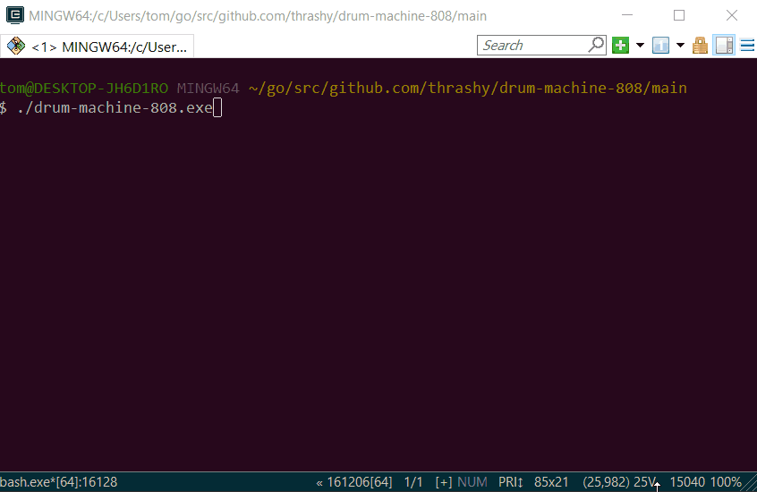

#  Roland 808 Drum Machine

Project structure follows the Go naming conventions defined here: https://github.com/golang-standards/project-layout

##  Assets

Sound files were sourced from http://smd-records.com/tr808/?page_id=14 They contain samples of an original TR-808 in WAVE format. No license information was given.

Patterns were sourced from http://www.ethanhein.com/wp/2010/drum-machine-programming for the following beats

* Generic Rock
* Generic Hip-Hop
* The Funky Drummer
* Impeach the President
* When the Levee Breaks
* Cold Sweat

##  Formatting and Linting

The project is formatted using gofmt with the command `go fmt ./...` at the project root.

Note to windows users: Administrator privileges are required to run this command.

##  Configuration

Configuration is stored in the `conf.toml` file.

The [song_beat.pattern] section contains a binary representation of a song beat. Listed below is the key to the patterns for each type of beat.

* **bd**: bass drum or kick drum
* **sn**: snare drum
* **hh**: closed hi-hat
* **oh**: open hi-hat
* **rd**: ride cymbal

##  Running the Application from Source

Extract all the files from the archive into GOPATH/src. The root folder of the application on my local machine looks like this:

`C:\Users\tflanagan\go\src\github.com\thrashy\drum-machine-808`

From the root of the application run the following commands:

* `go get -u github.com/faiface/beep`
* `go get -u github.com/manifoldco/promptui`
* `go get -u github.com/pelletier/go-toml`
* `go get -u github.com/google/go-cmp/cmp`
* `go get -u github.com/hajimehoshi/oto` - Dependency of beep
* `dep ensure` - Vendor in the dependencies
* `cd main`
* `go build -o drum-machine-808.exe` - exe extension for Windows
* `./drum-machine-808.exe`

##  Built With

* [Beep](https://github.com/faiface/beep) - Sound player for Go
* [Promptui](https://github.com/manifoldco/promptui) - Interactive prompt for a better console user experience.
* [go-toml](https://github.com/pelletier/go-toml) - Go library for the TOML format.

##  Sample Input/Output

